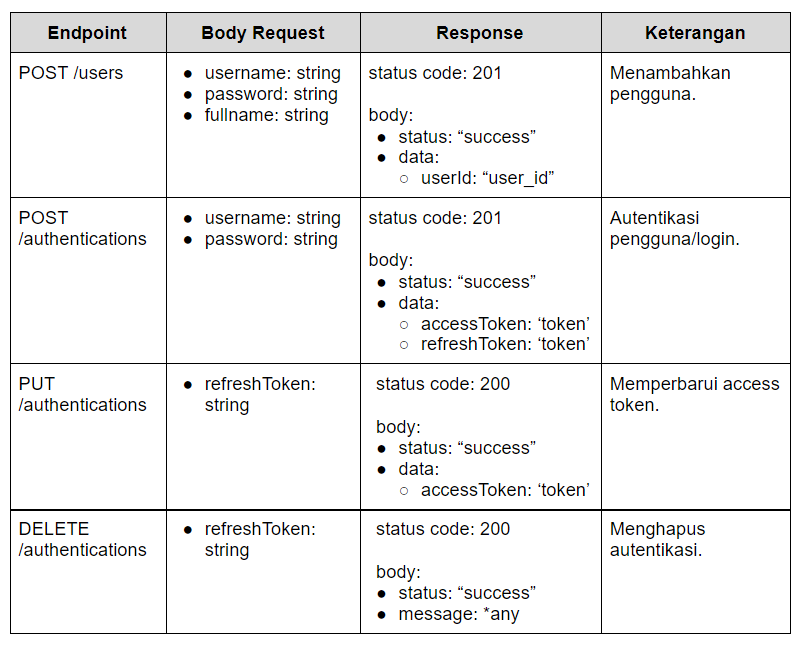
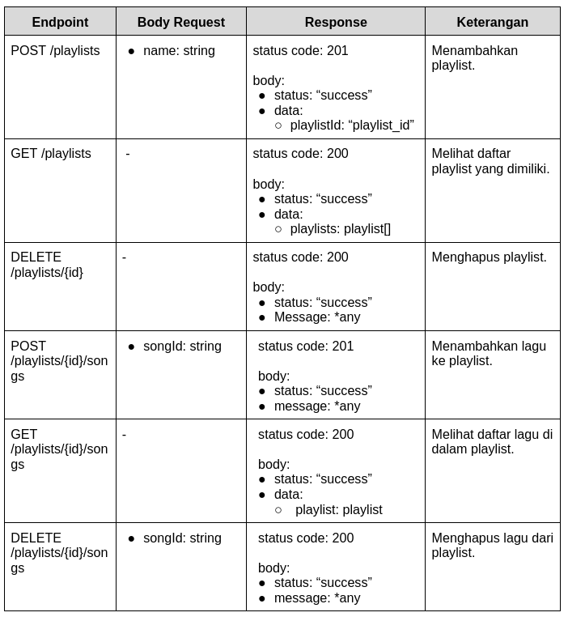
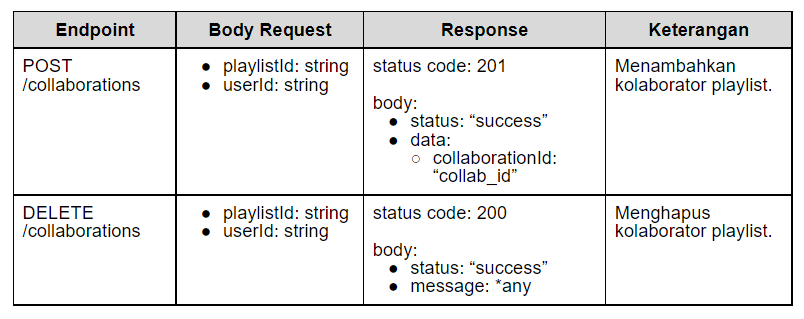

# Proyek OpenMusic API Versi 2

Dokumentasi ini menjelaskan kriteria utama dan opsional yang wajib dipenuhi untuk membangun proyek **OpenMusic API Versi 2**.

---

## ✅ Kriteria 1: Registrasi dan Autentikasi Pengguna

API harus memiliki fitur registrasi dan autentikasi pengguna dengan ketentuan berikut:



* **Username harus unik.**
* **Menggunakan JWT untuk autentikasi.**
* Payload JWT harus memuat `userId`.
* `ACCESS_TOKEN_KEY` dan `REFRESH_TOKEN_KEY` wajib menggunakan `.env`.
* Refresh token harus valid dan terdaftar di database.

---

## ✅ Kriteria 2: Pengelolaan Data Playlist

API harus memiliki fitur pengelolaan playlist dengan ketentuan:



* Playlist hanya dapat diakses dengan **access token**.
* `GET /playlists` hanya menampilkan playlist milik sendiri.
* Hanya pemilik (atau kolaborator) dapat mengakses dan memodifikasi isi playlist.
* `songId` harus valid saat dimasukkan/dihapus.

### Contoh Response:

#### `GET /playlists`

```json
{
  "status": "success",
  "data": {
    "playlists": [
      {
        "id": "playlist-Qbax5Oy7L8WKf74l",
        "name": "Lagu Indie Hits Indonesia",
        "username": "dicoding"
      },
      {
        "id": "playlist-lmA4PkM3LseKlkmn",
        "name": "Lagu Untuk Membaca",
        "username": "dicoding"
      }
    ]
  }
}
```

#### `GET /playlists/{id}/songs`

```json
{
  "status": "success",
  "data": {
    "playlist": {
      "id": "playlist-Mk8AnmCp210PwT6B",
      "name": "My Favorite Coldplay",
      "username": "dicoding",
      "songs": [
        {
          "id": "song-Qbax5Oy7L8WKf74l",
          "title": "Life in Technicolor",
          "performer": "Coldplay"
        },
        {
          "id": "song-poax5Oy7L8WKllqw",
          "title": "Centimeteries of London",
          "performer": "Coldplay"
        },
        {
          "id": "song-Qalokam7L8WKf74l",
          "title": "Lost!",
          "performer": "Coldplay"
        }
      ]
    }
  }
}
```

### Struktur Data Playlist

```json
{
  "id": "playlist-Qbax5Oy7L8WKf74l",
  "name": "Lagu Indie Hits Indonesia",
  "owner": "user-Qbax5Oy7L8WKf74l"
}
```

---

## ✅ Kriteria 3: Menerapkan Foreign Key

Wajib menggunakan relasi antar tabel, contoh:

* `songs` ↔ `albums`
* `playlists` ↔ `users`
* Relasi lainnya sesuai kebutuhan.

---

## ✅ Kriteria 4: Validasi Data (Data Validation)

Setiap request harus divalidasi. Berikut spesifikasinya:

* **POST /users**: `username`, `password`, `fullname` (required)
* **POST /authentications**: `username`, `password` (required)
* **PUT /authentications**: `refreshToken` (required)
* **DELETE /authentications**: `refreshToken` (required)
* **POST /playlists**: `name` (required)
* **POST /playlists/{playlistId}/songs**: `songId` (required)

---

## ✅ Kriteria 5: Penanganan Eror (Error Handling)

### Bad Request (400)

```json
{
  "status": "fail",
  "message": "Pesan error tidak boleh kosong"
}
```

### Not Found (404)

```json
{
  "status": "fail",
  "message": "Pesan error tidak boleh kosong"
}
```

### Unauthorized (401)

```json
{
  "status": "fail",
  "message": "Pesan error tidak boleh kosong"
}
```

### Invalid Refresh Token (400)

```json
{
  "status": "fail",
  "message": "Pesan error tidak boleh kosong"
}
```

### Forbidden (403)

```json
{
  "status": "fail",
  "message": "Pesan error tidak boleh kosong"
}
```

### Server Error (500)

```json
{
  "status": "error",
  "message": "Pesan error tidak boleh kosong"
}
```

---

## ✅ Kriteria 6: Pertahankan Fitur OpenMusic API v1

Pastikan semua fitur dari versi 1 tetap berfungsi:

* Konfigurasi Proyek Node.js
* Pengelolaan Album
* Pengelolaan Lagu
* Validasi Album & Lagu
* Penanganan Error

---

## 🌟 Kriteria Opsional

### Opsional 1: Fitur Kolaborasi Playlist



User yang ditambahkan sebagai kolaborator:

* Dapat melihat playlist di `GET /playlists`
* Bisa menambah/menghapus lagu
* Bisa melihat isi playlist
* Bisa melihat aktivitas playlist (jika fitur opsional 2 diaktifkan)

---

### Opsional 2: Fitur Playlist Activities

Menampilkan riwayat aktivitas playlist:

**Endpoint:**

```
GET /playlists/{id}/activities
```

**Response:**

```json
{
  "status": "success",
  "data": {
    "playlistId": "playlist-Mk8AnmCp210PwT6B",
    "activities": [
      {
        "username": "dicoding",
        "title": "Life in Technicolor",
        "action": "add",
        "time": "2021-09-13T08:06:20.600Z"
      },
      {
        "username": "dicoding",
        "title": "Centimeteries of London",
        "action": "add",
        "time": "2021-09-13T08:06:39.852Z"
      },
      {
        "username": "dimasmds",
        "title": "Life in Technicolor",
        "action": "delete",
        "time": "2021-09-13T08:07:01.483Z"
      }
    ]
  }
}
```

---

### Opsional 3: Pertahankan Kriteria Opsional dari Versi 1

* Daftar lagu dalam detail album.
* Query parameter pencarian lagu.